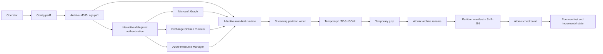

# Architecture

The suite is a PowerShell 7, single-process, local-filesystem archive pipeline. `Archive-M365Logs.ps1` validates configuration, establishes delegated interactive sessions, selects a deterministic run, and coordinates collectors. `M365Archive.Collectors.psm1` owns service-specific retrieval. `M365Archive.RateLimit.psm1` owns retry, pacing, adaptive windows, and circuit state. `M365Archive.Core.psm1` owns validation, partitioning, hashing, atomic writes, checkpoints, locking, and verification.

## Collection and commit flow

1. Configuration is loaded as a PowerShell hashtable and validated before authentication.
2. Fixed or incremental bounds are resolved. A deterministic run ID incorporates tenant, range, collector selection, window ceiling, scale policy, and resource controls.
3. An exclusive `.archive.lock` prevents concurrent runs against one output root.
4. The checkpoint restores collector cursors, active windows, and completed partition hashes.
5. Each collector retrieves half-open `[start,end)` windows. Graph and ARM page sequentially and stream records; Unified Audit Log (UAL) and Defender buffer bounded windows and bisect dense ranges.
6. Records are deduplicated inside each partition using native IDs or collector-specific stable keys. Keyless records use a SHA-256 hash of their serialized representation.
7. UTF-8 JSONL is written to a unique temporary file, compressed to a second temporary file, and atomically renamed. The adjacent manifest is written atomically only after the archive hash exists.
8. The checkpoint is advanced after the valid partition commit. The run manifest inventories all completed partitions and API metrics. Incremental state advances only when required collectors succeed.

## Atomicity, hashes, and fidelity

`Write-JsonAtomic` writes a same-directory unique `.tmp` file and renames it into place. Partition archives follow the same temporary-write/rename model. This protects against exposing a partially written final file on filesystems where same-volume rename is atomic. It does not make a collection transaction span multiple partitions.

Each successful partition manifest records the SHA-256 of the compressed `.jsonl.gz` bytes. `Test-Archive.ps1` recomputes that hash. Records are serialized as returned by the source and are not normalized; Azure subscriptions and Defender tables are separated in source directory names rather than injected into records.

## Checkpoints, resume, and deduplication boundaries

`_runs\<run-id>\checkpoint.json` records completed partitions, collector cursors, and active adaptive windows. A restart with identical effective configuration produces the same run ID, reuses the saved active boundary, and skips only partitions with a valid successful manifest and matching hash. Deduplication is partition-local, not a global database. Incremental overlap deliberately permits records to exist in more than one run; downstream consumers should reconcile using source IDs.

## Collector boundaries
Collectors do not write files or own retries. They emit source records and use `Invoke-ServiceOperation` for service calls. Core code does not know API schemas. This separation keeps authentication, paging, retention/licensing behavior, persistence, and adaptive policy independently testable. See [collector reference](collector-reference.md), [archive format](archive-format.md), and [recovery and idempotency](recovery-and-idempotency.md).
Collectors do not write files or own retries. They emit source records and use `Invoke-ServiceOperation` for service calls. Core code does not know API schemas. This separation keeps authentication, paging, retention/licensing behavior, persistence, and adaptive policy independently testable. See [collector reference](collector-reference.md), [archive format](archive-format.md), and [recovery and idempotency](recovery-and-idempotency.md).
